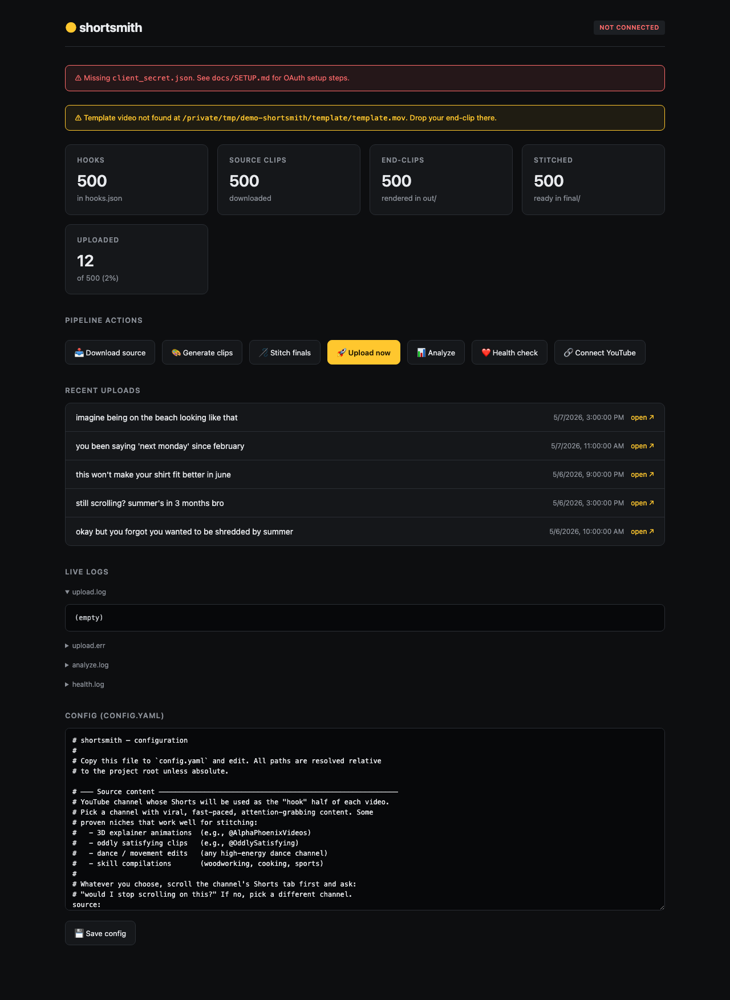

# shortsmith

> Open-source pipeline for stitching viral shorts into your own end-clips, then auto-posting to YouTube on a schedule.

<p align="center">
  
</p>

<p align="center">
  <a href="#quickstart">Quickstart</a> ·
  <a href="docs/SETUP.md">Setup</a> ·
  <a href="docs/NICHE_GUIDE.md">Niche guide</a> ·
  <a href="#dashboard">Dashboard</a> ·
  <a href="#ethics">Ethics</a>
</p>

---

## What this is

You record **one** end-clip of your product. shortsmith generates **N variants** with different hooks + CTAs (yellow/green/purple highlight boxes, Gen-Z TikTok voice), stitches each one onto a freshly-pulled viral short from the channel of your choice, and uploads to YouTube on a daily cadence — with a weekly analytics agent that detects winning hooks and amplifies them.

Built for indie founders, app devs, and creators who want to test 500 hook variations without making 500 videos by hand.

## What's different

- **The 500-hook generator** — not a paid tool slapping the same caption on every clip. Every video gets a unique, theme-matched hook + CTA with brand-color word highlights.
- **Self-pacing winner amplification** — weekly agent reads YouTube stats, finds your top performers, and bumps semantically-similar hooks to the front of the queue automatically.
- **Local first, no SaaS** — runs entirely on your machine via launchd / cron / Task Scheduler. No subscriptions, no upload-quota gates, no vendor lock-in. The whole pipeline is ~1500 lines of Python.
- **Cross-platform** — macOS, Linux, and Windows. Scheduled jobs adapt to whichever your OS uses.

## Quickstart

```bash
git clone https://github.com/mlvps/shortsmith.git
cd shortsmith
pip install -r requirements.txt

# install ffmpeg + yt-dlp for your OS
# macOS:    brew install ffmpeg yt-dlp
# Linux:    apt install ffmpeg && pipx install yt-dlp
# Windows:  choco install ffmpeg yt-dlp

# scaffold a project anywhere
mkdir my-campaign && cd my-campaign
shortsmith init

# 1. drop your end-clip here:  ./template/template.mov
# 2. edit config.yaml          (channel URL, brand colors, ntfy topic)
# 3. write hooks.json          (see examples/hooks_example.json)

shortsmith download    # pull source content via yt-dlp
shortsmith generate    # render N end-clips
shortsmith stitch      # combine source + clips → final/

shortsmith dashboard   # opens web UI on localhost:8765
```

In the dashboard: **Connect YouTube** → sign in with the Google account that owns your channel → **Upload now**.

## Dashboard

Single-page web UI on `http://127.0.0.1:8765`:

- pipeline stats (hooks, sources, clips, stitched, uploaded)
- one-click triggers for every step
- live tail of all log files
- recent uploads with direct links
- editable `config.yaml` in-browser
- YouTube connect button (launches OAuth flow)

```
shortsmith dashboard --port 8765
```

## Daily auto-posting

```bash
shortsmith schedule install
```

Detects your OS and installs scheduled jobs:

- **macOS** → launchd plists in `~/Library/LaunchAgents/`
- **Linux** → cron entries (managed block in user crontab)
- **Windows** → Task Scheduler tasks (`schtasks`)

| Job | Trigger | What it does |
|---|---|---|
| daily upload | configurable hours (default 9 / 13 / 19 local) | uploads 1 video per slot |
| weekly analyze | Sunday 10:00 | analytics + winner amplification + push notification |
| health check | Monday 08:00 | verifies all jobs healthy + push notification |

Stop anytime: `shortsmith schedule uninstall`. Status: `shortsmith schedule status`.

## Push notifications (optional, free)

Install the [ntfy](https://ntfy.sh) iOS/Android app, pick an unguessable topic name, subscribe, drop the topic into `config.yaml`:

```yaml
ntfy:
  topic: "shortsmith-yourname-7k9q2x"
```

You get a push when:
- the weekly analytics report runs (top hooks, view counts, winners)
- the health check finds an issue (job stopped, errors logged, queue running low)

## Niche recommendations

The "source channel" is your hook half — it determines whether someone stops scrolling. Pick a channel with **fast-paced, attention-grabbing, transformative content**:

- 🧪 **3D explainer animations** — `@AlphaPhoenixVideos`, `@TheActionLab`
- ✨ **oddly satisfying** — `@OddlySatisfying`, `@SatisfyingShorts`
- 💃 **dance / movement** — high-energy compilation channels
- 🪚 **skill compilations** — woodworking, cooking, sports

[Full niche guide →](docs/NICHE_GUIDE.md)

## Architecture

```
template.mov  ──┐
                ├─→  generate  ──→  out/clip_NNNN.mp4   (with hook + CTA)
hooks.json    ──┘                            │
                                             ▼
source/*.mp4 (yt-dlp) ────────────→  stitch  ──→  final/final_NNNN.mp4
                                             │
                                             ▼
                              upload (YouTube Data API)
                                             │
                       ┌─────────────────────┴─────────────────────┐
                       ▼                                            ▼
              uploaded.json                              priority.json
                       │                                            ▲
                       ▼                                            │
                  analyze ──→ winner detection ──→ amplification ───┘
```

Every step is a separate Python module under `shortsmith/` and is also a CLI subcommand. The dashboard just shells out to the same CLI commands you'd run by hand.

## Ethics

This tool downloads content from another creator's channel and combines it with your own clip. That's a gray area under YouTube's [reused-content policy](https://support.google.com/youtube/answer/2950818).

**Use responsibly:**
- Respect the source creators. Don't pretend their work is yours.
- Add real, transformative value — your end-clip should feel like a continuation, not a tag-on.
- Don't be surprised if YouTube flags or removes a video. The enforcement is opaque and inconsistent. Keep your channel diversified.
- Don't run this on accounts you can't afford to lose.

If a creator asks you to stop using their content as a hook source, switch channels. It costs you nothing and avoids drama.

This software is provided as-is, for educational and experimentation purposes. **You are responsible for what you do with it.** The author isn't liable for terminated channels, copyright strikes, or platform actions.

## Roadmap / contributions welcome

- [x] cross-platform scheduling (macOS / Linux / Windows)
- [ ] TikTok auto-upload (via unofficial API or postbridge bridge)
- [ ] LLM hook-generator helper built into CLI
- [ ] alternate caption styles (subway-surfers split, brain-rot top/bottom)
- [ ] multi-channel rotation
- [ ] Docker image for self-hosting
- [ ] systemd unit alternative for headless Linux servers

PRs welcome. Open an issue first if it's a big change.

## License

MIT. See [LICENSE](LICENSE).

## Credit

Built by [@melv-m](https://twitter.com/yourhandle). If you ship something cool with this, drop a link — I'll boost it.
