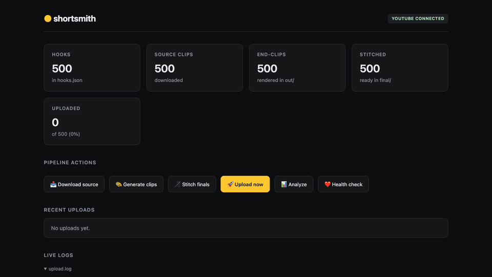

<div align="center">

# 🪡 shortsmith

**Open-source pipeline for stitching viral shorts and auto-posting to YouTube.**
One end-clip → 500 hook variations → daily auto-uploads → weekly winner amplification.

[](LICENSE)
[](https://www.python.org/downloads/)
[](https://github.com/mlvps/shortsmith/stargazers)
[](https://github.com/mlvps/shortsmith/network/members)
[](https://github.com/mlvps/shortsmith/issues)
[](https://github.com/mlvps/shortsmith/commits/main)
[](https://ffmpeg.org/)
[]()



[**Quickstart**](#quickstart) ·
[**Setup**](docs/SETUP.md) ·
[**Niche guide**](docs/NICHE_GUIDE.md) ·
[**Dashboard**](#dashboard) ·
[**Ethics**](#ethics)

</div>

---

## What this is

Most "auto-shorts" tools cost $19-$49/month and slap the same caption on every video. shortsmith is the **open source version**, with the things they hide:

- 🎯 **Per-video unique hooks + CTAs**, not just template fill-in. Brand-color highlight boxes (yellow/green/purple), Gen-Z TikTok voice, all lowercase.
- 🧠 **Generates the hooks for you** via your existing Claude / ChatGPT / Gemini / Ollama CLI subscription. **No API key required.** No per-token costs.
- 🔁 **Self-pacing winner amplification**, weekly agent reads your YouTube stats, finds your top performers, bumps semantically-similar hooks to the front of the queue.
- 🧵 **Stitch any source channel**, pulls Shorts via yt-dlp, normalizes to 9:16, concatenates first 5.5s with your end-clip.
- 🤖 **Auto-posts on a schedule**, 3 uploads per day at peak times. macOS, Linux, or Windows. Free YouTube Data API tier.
- 📊 **Local web dashboard**, every pipeline step has a button. Live logs. One-click "Connect YouTube" OAuth. Editable config in-browser.
- 📱 **Push notifications**, free via [ntfy.sh](https://ntfy.sh) when winners are detected or jobs fail.

No SaaS. No subscriptions. No vendor lock-in. ~1500 lines of Python.

## Quickstart

```bash
git clone https://github.com/mlvps/shortsmith.git
cd shortsmith
pip install -r requirements.txt

# install ffmpeg + yt-dlp for your OS
# macOS:    brew install ffmpeg yt-dlp
# Linux:    apt install ffmpeg && pipx install yt-dlp
# Windows:  choco install ffmpeg yt-dlp

# scaffold a project anywhere
mkdir my-campaign && cd my-campaign
shortsmith init

# 1. drop your end-clip here:  ./template/template.mov
# 2. edit config.yaml          (channel URL, brand colors, ntfy topic)

shortsmith hooks --count 100 --brand "bo" --theme "summer body, abs by june"
shortsmith download    # pull source content via yt-dlp
shortsmith generate    # render hook+CTA end-clip variants
shortsmith stitch      # combine source + clips → final/
shortsmith dashboard   # web UI on localhost:8765
```

In the dashboard: **Connect YouTube** → walks you through 6 setup steps with direct deep-links to Google Cloud Console (create project, enable API, configure OAuth consent, create credentials, drag-drop the JSON, click Connect). No CLI commands needed for OAuth.

## How does the hook generation work?

shortsmith does not call any LLM API. There is no API key to manage, no per-token cost. It detects whichever LLM CLI you already have installed and pipes the prompt into it as a subprocess.

| Provider | CLI | Backed by |
|---|---|---|
| **Claude Code** | `claude -p` | Your Claude Pro / Max subscription |
| **OpenAI Codex CLI** | `codex exec` | Your ChatGPT Plus subscription |
| **Google Gemini CLI** | `gemini` | Your Google AI Studio key |
| **Ollama** | `ollama run` | Fully local, offline |

`shortsmith hooks --provider auto` picks the first one installed. Output is parsed, validated, and written to `hooks.json`. The dashboard has a **Generate hooks** button that opens a form: brand name, theme, count, provider. No CLI needed if you'd rather click.

If no CLI is installed, shortsmith prints install instructions and exits. Pick whichever provider you already pay for, you do not pay shortsmith twice.

## Dashboard

A single-page web UI on `http://127.0.0.1:8765`:

- 📊 pipeline stats (hooks, sources, clips, stitched, uploaded)
- ▶️ one-click trigger for every step
- ✍️ **Generate hooks** button (auto-detects your installed LLM CLI, no API key)
- 📜 live tail of all log files
- 📥 recent uploads with direct YouTube links
- 🛠️ editable `config.yaml` in-browser
- 🔗 **Connect YouTube** wizard: 6 numbered steps with deep-links to the right Google Cloud pages, drag-drop your `client_secret.json`, one-click Connect

```bash
shortsmith dashboard --port 8765
```

## Daily auto-posting

```bash
shortsmith schedule install
```

Detects your OS and installs scheduled jobs:

- 🍎 **macOS** → launchd plists in `~/Library/LaunchAgents/`
- 🐧 **Linux** → cron entries (managed block in user crontab)
- 🪟 **Windows** → Task Scheduler tasks (`schtasks`)

| Job | Trigger | What it does |
|---|---|---|
| daily upload | configurable hours (default 9 / 13 / 19 local) | uploads 1 video per slot |
| weekly analyze | Sunday 10:00 | analytics + winner amplification + push |
| health check | Monday 08:00 | verifies all jobs healthy + push |

Stop anytime: `shortsmith schedule uninstall`. Status: `shortsmith schedule status`.

## Niche guide (this is 70% of the result)

The "source channel" is your hook half, it determines whether someone stops scrolling. Pick one with **fast-paced, attention-grabbing, transformative content**:

- 🧪 **3D explainer animations**
- ✨ **satisfying videos** (cleaning, slime, pressure-washing, marble runs)
- 💃 **female dancing**
- 🪚 **skill compilations** (woodworking, cooking, sushi rolling)

[**Full niche guide →**](docs/NICHE_GUIDE.md)

## Architecture

```
template.mov  ──┐
                ├─→  generate  ──→  out/clip_NNNN.mp4   (with hook + CTA)
hooks.json    ──┘                            │
                                             ▼
source/*.mp4 (yt-dlp) ────────────→  stitch  ──→  final/final_NNNN.mp4
                                             │
                                             ▼
                              upload (YouTube Data API v3)
                                             │
                       ┌─────────────────────┴─────────────────────┐
                       ▼                                            ▼
              uploaded.json                              priority.json
                       │                                            ▲
                       ▼                                            │
                  analyze ──→ winner detection ──→ amplification ───┘
```

Every step is a separate Python module under `shortsmith/` and is also a CLI subcommand. The dashboard just shells out to the same CLI commands you'd run by hand.

## Push notifications (optional, free)

Install the [ntfy](https://ntfy.sh) iOS/Android app. Pick an unguessable topic name. Subscribe. Drop the topic into `config.yaml`:

```yaml
ntfy:
  topic: "shortsmith-yourname-7k9q2x"
```

You get a push when:
- the weekly analytics report runs (top hooks, view counts, winners detected)
- the health check finds an issue (job stopped, errors logged, queue running low)

## Ethics

This tool downloads content from another creator's channel and combines it with your own clip. That's a gray area under YouTube's [reused-content policy](https://support.google.com/youtube/answer/2950818).

**Use responsibly:**
- Respect the source creators. Don't pretend their work is yours.
- Add real, transformative value, your end-clip should feel like a continuation, not a tag-on.
- Don't be surprised if YouTube flags or removes a video. The enforcement is opaque and inconsistent. Keep your channel diversified.
- Don't run this on accounts you can't afford to lose.

If a creator asks you to stop using their content as a hook source, switch channels. It costs you nothing and avoids drama.

This software is provided as-is, for educational and experimentation purposes. **You are responsible for what you do with it.** The author isn't liable for terminated channels, copyright strikes, or platform actions.

## Roadmap

- [x] Cross-platform scheduling (macOS / Linux / Windows)
- [x] Web dashboard with one-click OAuth
- [x] Winner amplification via weekly analytics agent
- [ ] TikTok auto-upload (via unofficial API or postbridge bridge)
- [ ] LLM hook-generator helper built into CLI
- [ ] Alternate caption styles (subway-surfers split, brain-rot top/bottom)
- [ ] Multi-channel rotation
- [ ] Docker image for self-hosting
- [ ] systemd unit alternative for headless Linux servers

[**Open an issue**](https://github.com/mlvps/shortsmith/issues/new) if you want to contribute. PRs welcome, see [CONTRIBUTING.md](CONTRIBUTING.md).

## Show off your campaign

If you ship something with shortsmith, **drop a link in the [Show & Tell discussion](https://github.com/mlvps/shortsmith/discussions)**, I'll boost it on Twitter.

## License

MIT. See [LICENSE](LICENSE).

## Star history

[](https://star-history.com/#mlvps/shortsmith&Date)

---

<div align="center">

Built by [@mlvps](https://twitter.com/melvinmorina). If this saves you a weekend, **drop a ⭐**.

</div>
